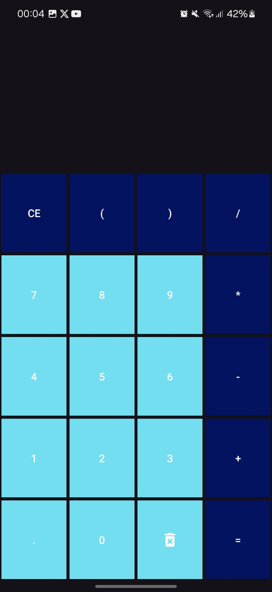
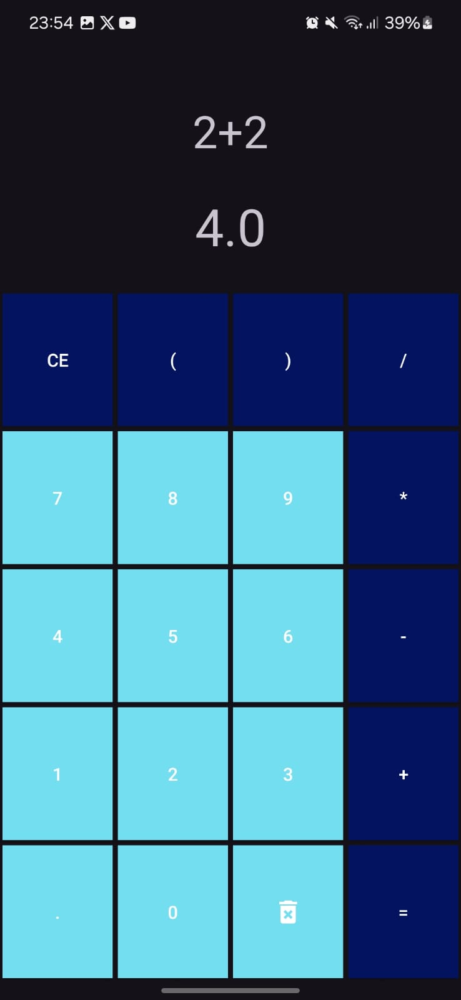

# 📱 Android Calculator App

Este projeto é uma aplicação Android desenvolvida em Kotlin, com o objetivo de simular o funcionamento de uma calculadora simples e eficiente, permitindo ao usuário realizar operações matemáticas básicas de forma intuitiva.
O projeto faz parte da disciplina **Desenvolvimento para Dispositivos Móveis** no curso de **Análise e Desenvolvimento de Sistemas (6º Período - IFTM)**.

---

## 🎯 Objetivo

Desenvolver uma calculadora funcional que permita realizar operações como soma, subtração, multiplicação e divisão, com suporte a expressões completas e interface amigável para o usuário.

---

## 🚀 Recursos Implementados

- ✔ Digitação de expressões matemáticas completas  
- ✔ Exibição em tempo real da expressão e do resultado  
- ✔ Suporte a parênteses e ponto decimal  
- ✔ Botão para apagar o último caractere  
- ✔ Botão para limpar toda a expressão  
- ✔ Interface responsiva e organizada por meio de ConstraintLayout e TableLayout  
- ✔ Avaliação das expressões utilizando a biblioteca `mxparser`

---

## 🛠 Tecnologias Utilizadas

- 🔧 Kotlin  
- 🔧 Android Studio  
- 🔧 ViewBinding  
- 🔧 ConstraintLayout  
- 🔧 TableLayout  
- 🔧 Biblioteca `mxparser` para cálculo de expressões

---

## 📱 Interface do Projeto

 

---

## 🧩 Estrutura do Código

### 📌 `MainActivity.kt`  
Gerencia toda a lógica da calculadora, incluindo:
- ✔ Captura de eventos dos botões  
- ✔ Atualização da expressão exibida  
- ✔ Cálculo do resultado usando `Expression` da biblioteca `mxparser`

### 📌 `activity_main.xml`  
Define o layout da aplicação com:
- ✔ Um visor para a expressão e resultado  
- ✔ Tabela de botões organizados por linhas e colunas  
- ✔ Uso de `ConstraintLayout` para responsividade

---

> **IFTM - Instituto Federal do Triângulo Mineiro**  
> Disciplina: Desenvolvimento para Dispositivos Móveis  
> 6º Período de ADS – 2025
